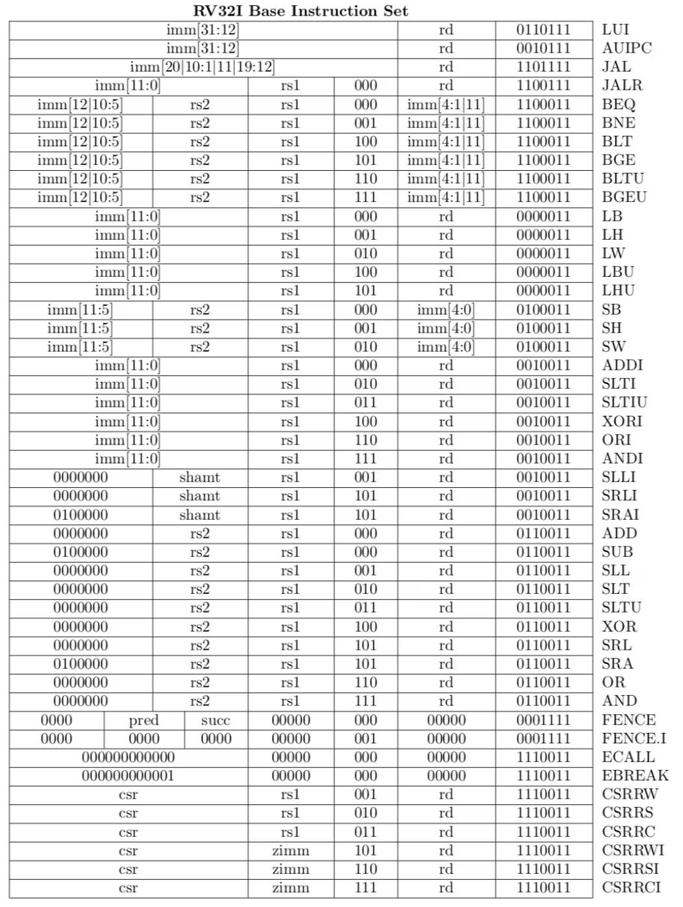

## 取り扱う項目
- 第一章補足
    - フォンノイマン型アーキテクチャ
    - なぜ文字化けするのか
- 第二章補足
    - CPUのスペックをみる
- 第三章補足
    - CPUでの命令の実行手順
    - 実際に使われるアセンブリを見てみる RISC-V
## 第一章補足

### プログラム内蔵方式
コンピュータのアーキテクチャは多くがプログラム内蔵方式です。
これは主記憶に保存してあるプログラムを実行する、というアーキテクチャです。
ここでいう主記憶というのはメモリのことですが、「プログラムやデータはSSDとかHDDに入っているのでは？」と思われたかもしれません。
それらの記憶装置は二次記憶と呼ばれ、プログラムにしろデータにしろ、メモリに移されてから処理されます。

また、主記憶や二次記憶に保存されているものは、プログラムと画像やテキストなどのデータに分けて考えます。
どちらも0と1であらわされますが、コードをコンパイルしたバイナリやソフトウェアはプログラムの方です。
「プログラムを実行する」、というのが秀逸で、例えば電卓は決められた入力（数字と＋などの演算子）のみしか受け付けません。
一方、プログラム内蔵方式では、プログラムの最小単位である命令を組み合わせて主記憶におくことで、自由な計算をできます。
ちなみに、この言葉が使われるようになるまでのコンピュータでは、回路の配線を人力で組み替えることで任意の関数を実現していたようです。
プログラム内蔵方式の代表例として、ノイマン型アーキテクチャがよく説明されますが、その概略図が以下の通りです。

これは、プログラムとデータを区別せずにMemory Unitに入れます。
Control Unitがそのプログラムの実行を制御し、Arithmetic/Logic Unitが命令一つずつの演算を行います。
Memory UnitからCentral Processin Unitへの矢印は、命令やデータがロードされ、逆の矢印は、演算によって計算された新しい値をMemory Unitへとストアする、という流れを表しています。
Input DeviceとOutput Deviceは、例えば、キーボードとスクリーンなどです。
細かい話をすると、現代のコンピューターでは命令用とデータ用のメモリを分けているので、ノイマン型アーキテクチャではなく、ハーバードアーキテクチャといった方が適切なようです。

!!! info "フォイノイマンボトルネック"
    プログラム内蔵方式での、CPUが十分に早くなるとコンピューターの処理速度はCPUとメモリの転送時間に支配される、という性能上のボトルネックです。
    CPUの演算の速度がどれだけ向上しても、メモとCPUのデータのやりとりが時間が、演算の何倍も時間がかかると、コンピューターの性能が上がらない、ということです。
    AI・LLMの大規模化をする上で、 CPUもGPUもプログラム内蔵方式であり、それらの計算チップとメモリのデータの転送に時間と電力の多くを消費しているため、最近でもよく聞きます。
    例えば、メモリチップの中に演算回路を入れるCIM(Compute-in-Memory)という技術は、フォイノイマンボトルネックへの解決策として提示され、研究されています。

### なぜ文字化けするのか
コンピューターの内部では全ては数値データで表されていますが、文字化けはそのいい例です。
文字化けというのは、コンピューターで表示される文字が意図したものではないバグを言います。
「縺」「繧」「繝」などの文字を見かけたことはあるのではないのでしょうか。
これは、文字と数値データの関係表がいくつかあるためおこるバグです。
コンピューターでは、例えば、"電"という文字に対して、数値での表し方が決まりによって異なりますが、その決まりを間違えて解釈して表示すると、おかしな感じが表示されることになります。

具体的にはWindows向けのShift-JISとUTF-8という文字コードがあるため、Shift-JISでコードしているのに、それをUTF-8として解釈してしまうことにより、表示がおかしくなってしまいます。

!!! tip "パソコンとコンピュータ"
    情報系の学科に入ってから、特に意識するようになったのがパソコンとコンピューターの言葉の使い分けです。
    個人用のコンピューターをパソコンと呼ぶ、ということの以上でも以下でもないのですが、我々は自分たちの分野をコンピューター分野と言いますし、「個人の」というニュアンスが含まれない限りは「パソコン」という言葉を使うことはありません。
    ラップトップのPCではなくて、スパコンとかを念頭に置いて勉強、研究している学生が多いので、「コンピューター」という言葉の方にこだわりがあるような気がします。
    ちなみにコンピューターの意味で「計算機」なんて言うこともある気がします。

!!! info "量子コンピューター"
    量子コンピューターは驚異的な計算能力があり、実現したら暗号が破られてしまう、という言説はよく聞きます。
    この言説自体は正しいらしいのですが、決してその他の例えばAIの学習などもブレイクスルーがもたらされることが約束されている、といわけではないでしょう。
    量子コンピューターはCPUのように何でもプログラムを実行することができるチューリング完全性はありますが、暗号を破るための計算に特化した実装をできるから量子コンピューターは速いのであって、現状だとあらゆる計算を高速化することができるわけではないようです。
    また、現状では、量子コンピューターの実現には誤り訂正をする古典コンピューター（私たちが普段使うコンピューター。量子コンピューターと区別するときの呼び方）も必要となりますが、この古典コンピューターの作成自体も相当に難しいようです。

## 第二章補足
### CPUのスペックをみる
CPUのスペックとして家電量販店で提示されるのは、コア数、周波数、キャッシュです。
これらは全て大きい方がハイスペックということにはなりますが、消費電力や価格がトレードオフとなります。
コア数はCPUに搭載されている、一つのプログラムをそれひとつで完結して実行できる計算コアの数を表しています。
コンピューターでは同時にいくつものプログラムを動いており、それらのプログラムは「プロセス」と呼ばれます。
ChromeでYoutubeで動画を視聴すること一つとっても、そのソフトウェア(Chrome)を動かすために、いくつものプロセスが動いています。
コアは一つのプロセス（正確にはスレッドですが、そこまでは踏み込みません）を実行することができるので、現代のコンピューターではコア数以上のプロセスが実行され、それらが順番に実行されており、同時にはコア数までのプロセスが実行されています。

周波数はCPUの実行の速さともいえます。例えば、5GHzであったら、一秒間に$5 * 10^9$個の命令を最大で実行できることを表します。
ただし、CPUの発熱に合わせてクロック周波数は調整されますし、また、メモリへのアクセスは数百クロックかかり、その間は次のプログラムは実行できません。
コラムで詳細を解説しますが、CPUの命令の実行は細かいステージに分割されており、そのステージごとに一つ一つの命令が入っており、バケツリレーのように実行されます。
例えば、5ステージの場合は、それぞれのステージに一つで合計で5個の命令がCPUでは実行途中であるということです。
そして、そのステージの中で最も時間がかかる経路（クリティカルパス）から、周波数は決められることになります。

キャッシュはCPUの内部のメモリです。
コンピューターでは、メモリに変数などのデータを保存しますが、それらをレジスタに移してから、レジスタ同士の足し算などをしてその結果をあるレジスタに入れる、という形で演算をします。
レジスタも「値を保存する」という意味ではメモリのようなものですが、CPUの細かい話をするときには、明確に「レジスタ」と呼び、プログラムやデータの大元が保存されているメモリとは区別します。
レジスタの値を取り出すのは1クロックでできるわけですが、メモリの値をレジスタに入れるまでは数百クロックかかるので、その間の中間のメモリのようなものが欲しくなり、これがキャッシュと呼ばれるものです。
メモリからキャッシュにデータが移され、キャッシュからレジスタにコピーされます。
最近使った変数の値はキャッシュに保存されており、キャッシュには数十クロックでアクセスできるので、次に使うときにはすぐに値を得ることができます。
さらにキャッシュも細かく分かれており、メモリ、L3キャッシュ、L2キャッシュ、L1キャッシュ、レジスタの順で値は移されていきます。
このキャッシュも大きい方がいいのでCPUのスペックとして提示されるというわけです。

!!! info "キャッシュをクリアする"
    昔から使っているパソコンの速度を速くするために、キャッシュをクリアすることが推奨されますが、この場合のキャッシュはCPUのL1キャッシュなどではなく、システムキャッシュのことを言います。
    キャッシュの「アクセスに時間がかかるものをより近くに配置する」という概念は共通ですが、紹介したCPUキャッシュ、システムキャッシュ、ブラウザキャッシュ、そしてディスクキャッシュがあります。
    ディスクキャッシュは二次記憶でアクセスが多いゆえに、メモリに常駐しているデータで、OSが管理をするので、ユーザーがいじることはあまりありません。
    システムキャッシュは、メモリに置かれているアプリやOSがよく使うファイルをさし、長期間クリアしていないと溜まることがあるので、これをクリアすると使えるメモリの容量が増え、高速化するかもしれません。
    ただ、そのあたりのキャッシュの管理の最適化をOSで行っている場合もあるので、効果は保証できません。

## 第三章補足
### CPUでの命令の実行手順
CPUはいくつかのステージに分かれており、バケツリレーのように実行されていくと説明しました。
パソコンに積んであるような高性能なCPU（高性能というとスパコンなどを考えるかもしれませんが、家電に積んであるチップもCPUですので、PCに搭載されているというだけで十分、高性能です）は20~30ほどステージが今はありますが、教育目的でよく説明されるステージの数は5つです。
Fetch, Decode, Execute, Memory Access, Write Backの5つです。
Fetchが命令(32bitか64bit)をCPUへと持ってくるステージ、Decodeがその命令をどのレジスタにどの操作をするのかを解析してレジスタから値を読み出すステージ、Executeが読み出された値から足し算や引き算などを実行するステージ、Memmory Accessがメモリからデータを読んだり書き込んだりするステージ、Write Backが演算結果をレジスタに書き込むステージです。

このステージ間をバケツリレーのように命令を渡していき実行することをパイプライン実行と言います。
すべてのステージを1クロックで完了できるように、一番時間がかかるステージから、その時間の逆数をとってクロック周波数を決めることができます。
よりステージを細かく分割していけば、一つのステージでかかる時間が短くなるので、クロック周波数は上げることができますが、その分、回路が複雑になるので、20~30程度に落ちつているようです。
ステージの間にはパイプラインレジスタという、そのパイプラインの処理の結果を保存するレジスタがあります。
これがないとただ線で繋ぐのみなので、ステージに分割するということができません。
パイプラインレジスタはCLK信号をもとに、1クロックごとに処理結果を新しく保存する、ということをします。

加算命令をもとにそれぞれのステージで何をするのかを見てみましょう。
まず、加算命令を"ADD r1, r1, r2"とします。
これはレジスタ1とレジスタ2の値を足し算して、レジスタ1に入れることを意味します。
fetchステージでは"ADD r1, r1, r2"をあらわすビット列をメモリから取り出し、fdパイプラインレジスタに入れます。
decodeステージでは、命令列を解析し、レジスタ1とレジスタ2にアクセスして取得した値、ADDに対応するopcode、演算結果を格納するレジスタの番号をdeレジスタに入れます。
executeステージでは、加算対象の値を実際に加算する計算をし、その結果と演算結果を格納するレジスタの番号をemパイプラインレジスタに入れます。
memory accessステージでは、特に何もせずに、その結果と演算結果を格納するレジスタの番号をmwパイプラインレジスタに入れます。
write backステージでは、レジスタ1にその値を入れます。

他にも、"LOAD r1, r2"というレジスタ2の値をアドレスとして、そこのメモリの値を取得して、レジスタ1に格納する命令について見てみます。
fetchステージでは"LOAD r1, r2"をあらわすビット列をメモリから取り出し、fdパイプラインレジスタに入れます。
decodeステージでは、命令列を解析し、レジスタ2にアクセスして取得した値、LOADに対応するopcode、演算結果を格納するレジスタの番号をdeレジスタに入れます。
executeステージでは、特に何もせず、レジスタ2にアクセスして取得した値、LOADに対応するopcode、演算結果を格納するレジスタの番号をemレジスタに入れます。
memory accessステージでは、アドレスから値を取り出し、その値と演算結果を格納するレジスタの番号をmwパイプラインレジスタに入れます。
write backステージでは、レジスタ2にその値を入れます。

### 実際に使われるアセンブリを見てみる RISC-V
前置きが長くなりますが、少しアセンブリについて細く説明をします。
アセンブリはいくつかありますが、有名なのはx86-64とAArch64でしょう。
x86-64はIntel社が開発したアセンブリで、このアセンブリ対応のチップをIntelが製造し、そのチップをWindowsパソコンに搭載するという、Wintelという組み合わせが2010年ぐらいまで？市場を席巻していました。
最近は、アセンブリはx86-64でもCPUの回路自体はAMDという会社が開発してRyzenシリーズが人気です。
また、Macに搭載されるCPUもこれまではx86-64のアセンブリに対応したIntelのものでしたが、2020年からM1 Macと呼ばれる、Arm社のAArch64というアセンブリに対応した自社開発のMシリーズチップが搭載されるようになっています。

実行するバイナリはアセンブリに対応するため、ソフトウェアをダウンロードしようとしても、M1 MacとIntel Macで別々のファイルが配布されています。
もう少し細かい話をすると、例えば、C言語でプログラムを書いたとしても、それをパソコンで実行するためには、バイナリへとコンパイルする必要があります。
バイナリとアセンブリは一対一対応で、バイナリを人が読みやすいようにテキスト形式にしたものがアセンブリであるため、パソコンのCPUの対応するアセンブリが異なれば、コンパイルで作成するバイナリも異なるものになります。
ソフトウェアは配布の仕方がいくつかありますが、多くはコンピューターで実行できる形式(Windowsならexeファイル)ですので、バイナリ形式ということになり、同じOSだとしてもCPUが違うと異なるファイルが必要になる、ということです。
ですので、M1 Macが登場した初期は、Intel Macだと使えるがM1 Macだと使えないソフトウェア、というものがよくあり、苦労しました。
変換ソフトをAppleが配布してはいたのですが、x86-64のためのバイナリをAArch64のバイナリへと変換するということなので、速度の面ではあまり十分ではなかった記憶があります。

!!! info "ソフトバンクとArm"
    Armの親会社はソフトバンクです。
    2016年にソフトバンクが買収し、それから何度か売却のニュースを見ましたが、今でも保有しているようです。
    Armは自社開発のチップを生産するのではなく、自社のAArch64というアセンブリのライセンスでビジネスをしています。
    ですので、AppleはM1 チップを生産する際に、アセンブリ使用のライセンス料をArmに支払っています。

昨今の日米貿易戦争の中で、中国が自国でチップの生産もするようになっており、そのアセンブリとして採用しているのがRISC-Vです。
これはUC Bercleyで開発されたオープンソースのアセンブリで、無料で使用することができます。
実用的なCPUも作成されている一方で、近年では教育目的でも採用されており、ここでも実際の中身を見てみます。

これはRV 32IというRISC-Vのベーシックな命令セット(Instruction Set Architecture, ISA)です。
例えば、OSを動かしたり、より複雑な小数計算するとなると、追加のセットが必要となります。
RISC-Vは一つの命令が32bitですので、それぞれのbitが何に対応しているかの表です。
また、計算で使うレジスタは32本なので、rs1やrs2、rdが5bitなのは、$2^5=32$で5bitあれば32本を区別できるからです。
例えば、ADD命令とSUB命令をみてみると、30bit目だけが違うことがわかります。
五段ステージのCPUを組むなら、例えば、ここの違いでopcodeを使い分ける、ということを考えればいいわけです。
