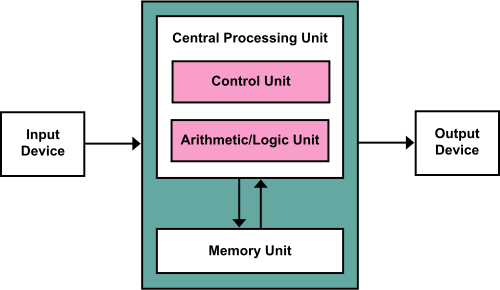

## 取り扱う項目
- 第一章補足
    - フォンノイマン型アーキテクチャ
    - なぜ文字化けするのか
## 第一章補足

### プログラム内蔵方式
現代のコンピュータのアーキテクチャは多くがプログラム内蔵方式です。
これは主記憶に保存してあるプログラムを実行する、というアーキテクチャです。
ここでいう主記憶というのはメモリのことですが、「データはSSDとかHDDに入っているのでは？」と思われたかもしれません。
それらの記憶装置は二次記憶と呼ばれ、そのデータを扱うときはそこからメモリに移されてから処理されます。

また、主記憶や二次記憶に保存されているものは、プログラムと画像やテキストなどのデータに分けて考えます。
どちらも0と1であらわされますが、Pythonなどで記述するコードはプログラムの方です。
「プログラムを実行する」、というのが秀逸で、例えば電卓は決められた入力（数字と＋などの演算子）のみしか受け付けません。
しかし、プログラムの最小単位である命令をいくらでも組み合わせて主記憶においておけば、任意の入力から出力までの関数を実現することができる、ということです。
ちなみに、この言葉が使われるようになるまでのコンピュータでは、回路の配線を人力で組み替えることで任意の関数を実現していたようです。
プログラム内蔵方式の代表例として、ノイマン型アーキテクチャがよく説明されますが、その概略図が以下の通りです。

これは、プログラムとデータを区別せずにMemory Unitに入れます。
Control Unitがそのプログラムを順に実行をするように制御し、Arithmetic/Logic Unitが命令一つずつの演算を行います。
Memory UnitからCentral Processin Unitへの矢印は、命令やデータがロードされ、逆の矢印は、演算によって計算された新しい値をMemory Unitへとストアする、という流れを表しています。
Input DeviceとOutput Deviceは、例えば、キーボードとスクリーンなどです。
細かい話をすると、現代のコンピューターでは命令用とデータ用のメモリを分けているので、ノイマン型アーキテクチャではなく、ハーバードアーキテクチャといった方が適切です。

では、このプログラム内蔵方式ではないコンピューターとは何なのでしょうか。
プログラム内蔵方式がコンピューターの定義になっていることもあるので、微妙な議論ではありますが、電卓は明確に違います。
電卓の計算回路は、対応している計算に特化しているもので、任意のプログラムを実行する、というものではありません。
ただし、この用語自体は、プログラムを変更するたびにコンピューターの配線を繋ぎ変えていた、という時代に、メモリから読み込むだけである、という点で差別化することを念頭において、作られた言葉です。

!!! info "フォイノイマンボトルネック"
    プログラム内蔵方式での、CPUが十分に早くなるとコンピューターの処理速度はCPUとメモリの転送時間に支配される、という性能上のボトルネックです。
    CPUの演算の速度がどれだけ向上しても、メモとCPUのデータのやりとりが時間が、演算の何倍も時間がかかると、コンピューターの性能が上がらない、ということです。
    AI・LLMの大規模化をする上で、 CPUもGPUもプログラム内蔵方式であり、それらの計算チップとメモリのデータの転送に時間と電力の多くを消費しているため、最近でもよく聞きます。
    その解決策として、例えば、メモリチップの中に演算回路を入れるCIM(Compute-in-Memory)が研究されています。

### なぜ文字化けするのか
コンピューターの内部では全ては数値データで表されていますが、その例として、文字化けを取り上げます。
文字化けというのは、コンピューターで表示される文字が意図したものではないバグを言います。
「縺」「繧」「繝」などの文字を見かけたことはあるのではないのでしょうか。
これは、文字と数値データの関係表がいくつかあるためおこるバグです。

ぐた

!!! tip "パソコンとコンピュータ"
    情報系の学科に入ってから、特に意識するようになったのがパソコンとコンピューターの言葉の使い分けです。
    個人用のコンピューターをパソコンと呼ぶ、ということの以上でも以下でもないのですが、我々は自分たちの分野をコンピューター分野と言いますし、「個人の」というニュアンスが含まれない限りは「パソコン」という言葉を使うことはありません。
    ラップトップのPCではなくて、スパコンとかを念頭に置いて勉強、研究している学生が多いので、「コンピューター」という言葉の方にこだわりがあるような気がします。
    ちなみにベテランになるとコンピューターの意味で「計算機」なんて言うこともある気がします。

!!! info "量子コンピューター"
    量子コンピューターは驚異的な計算能力があり、実現したら暗号が破られてしまう、という言説はよく聞きます。
    この言説自体は正しいらしいのですが、決してその他の例えばAIの学習などもブレイクスルーがもたらされることが約束されている、といわけではないでしょう。
    量子コンピューターはCPUのように何でもプログラムを実行することができるチューリング完全性はありますが、暗号を破るための計算に特化した実装をできるから量子コンピューターは速いのであって、現状だとあらゆる計算を高速化することができるわけではないようです。
    また、量子コンピューターの実現には誤り訂正をする古典コンピューター（私たちが普段使うコンピューター。量子コンピューターと区別するときの呼び方）も必要となりますが、この古典コンピューターの作成自体も相当に難しいようです。
